# 📡 PICORadar

<div align="center">


**实时、低延迟的多用户VR位置共享系统**

[](https://isocpp.org/)
[](https://cmake.org/)
[](#testing)
[](#installation)

[✨ 特性](#-核心特性) • [🚀 快速开始](#-快速开始) • [📖 文档](#-文档) • [🛠️ 开发](#-开发) • [🤝 贡献](#-贡献)

</div>

---

## 🎯 项目概述

**PICORadar** 是一个专为多用户、共处一室的VR体验设计的**实时位置共享系统**。其核心使命是通过在每位玩家的头显中精确渲染其他玩家的虚拟形象，来**防止在大型共享物理空间中可能发生的物理碰撞**。

系统完全在**局域网（LAN/WLAN）**内部署和运行，确保其独立、高速且不依赖任何外部互联网连接。

### 🎮 应用场景

- **VR 体验中心**: 多人同时在大空间内体验不同VR内容
- **VR 培训设施**: 团队协作训练和模拟演练
- **VR 游戏馆**: 多人VR游戏和娱乐体验
- **VR 会议室**: 虚拟现实会议和协作空间

## ⭐ 核心特性

<table>
<tr>
<td width="50%">

### 🚀 高性能
- **多玩家支持**: 稳定支持最多 **20名** 玩家同时在线
- **超低延迟**: 端到端延迟 **< 100毫秒**
- **高并发**: 基于现代C++17异步架构
- **零内存泄漏**: 通过RAII和智能指针确保

</td>
<td width="50%">

### 🔧 易于使用
- **零配置连接**: UDP广播自动发现服务器
- **跨平台构建**: Linux/Windows，使用CMake+vcpkg
- **现代CLI界面**: 基于FTXUI的实时监控界面
- **简洁API**: 易于集成到游戏引擎中

</td>
</tr>
<tr>
<td width="50%">

### 🛡️ 安全可靠
- **预共享令牌**: 基于PSK的客户端鉴权
- **优雅断连**: WebSocket标准化关闭握手
- **网络防护**: 防火墙配置和入侵检测
- **审计日志**: 完整的安全事件记录

</td>
<td width="50%">

### 📊 生产就绪
- **88个测试用例**: 100%通过率，全覆盖测试
- **统一日志系统**: 基于glog的结构化日志
- **性能监控**: 实时状态监控和报告
- **部署文档**: 完整的生产环境部署指南

</td>
</tr>
</table>

## 📈 项目状态

<div align="center">

| 组件           | 状态     | 测试覆盖率 | 文档状态 |
|--------------|--------|-------|------|
| 🌐 **服务端**   | ✅ 生产就绪 | 100%  | ✅ 完整 |
| 📚 **客户端库**  | ✅ 生产就绪 | 100%  | ✅ 完整 |
| 🔧 **配置系统**  | ✅ 生产就绪 | 100%  | ✅ 完整 |
| 📊 **CLI界面** | ✅ 生产就绪 | 100%  | ✅ 完整 |
| 🔒 **安全机制**  | ✅ 生产就绪 | 100%  | ✅ 完整 |

**总体状态**: 🟢 **生产就绪** | **测试**: ✅ 88/88 通过 | **延迟**: < 100ms | **并发**: 20+ 连接

</div>

查看详细的 [项目状态总结 📊](PROJECT_STATUS_SUMMARY.md) 和 [开发路线图 🗺️](ROADMAP.md)

## 🚀 快速开始

### 📋 系统要求

| 组件        | 最低要求                           | 推荐配置                             |
|-----------|--------------------------------|----------------------------------|
| **操作系统**  | Ubuntu 18.04+ / Windows 10+    | Ubuntu 22.04+ / Windows 11       |
| **编译器**   | GCC 7+ / Clang 6+ / MSVC 2019+ | GCC 11+ / Clang 13+ / MSVC 2022+ |
| **内存**    | 4GB RAM                        | 8GB+ RAM                         |
| **CMake** | 3.20+                          | 最新版本                             |
| **网络**    | Gigabit Ethernet               | 低延迟交换机                           |

### ⚡ 一键安装

```bash
# 🐧 Linux / 🍎 macOS
curl -fsSL https://raw.githubusercontent.com/SakuraPuare/PicoRadar/main/scripts/install.sh | bash

# 🪟 Windows (PowerShell)
irm https://raw.githubusercontent.com/SakuraPuare/PicoRadar/main/scripts/install.ps1 | iex
```

### 🔧 手动安装

<details>
<summary>点击展开详细安装步骤</summary>

#### 1️⃣ 克隆仓库

```bash
# 克隆仓库（包含 vcpkg 子模块）
git clone --recursive https://github.com/SakuraPuare/PicoRadar.git
cd PicoRadar

# 如果已克隆但未包含子模块
git submodule update --init --recursive
```

#### 2️⃣ 配置构建

```bash
# 配置 CMake（首次运行会自动安装依赖，需要 15-30 分钟）
cmake -B build -S . -G Ninja \
    -DCMAKE_TOOLCHAIN_FILE=vcpkg/scripts/buildsystems/vcpkg.cmake \
    -DCMAKE_BUILD_TYPE=Release
```

#### 3️⃣ 编译项目

```bash
# 编译所有组件
cmake --build build --parallel

# 可选：运行测试验证安装
cd build && ctest --output-on-failure
```

</details>

### 🎮 运行服务器

```bash
# 运行服务器（默认端口 9002）
./build/src/server/server

# 使用自定义配置
./build/src/server/server --config config/server.json

# 传统 CLI 模式
./build/src/server/server --traditional
```

### 🎯 连接客户端

```cpp
#include "client.hpp"
using namespace picoradar::client;

int main() {
    Client client;
    
    // 自动发现并连接服务器
    auto server = client.discover_server("your-secret-token");
    client.connect(server.host, server.port, "your-secret-token");
    
    // 发送位置数据
    PlayerData data;
    data.player_id = "player_001";
    data.position_x = 1.0f; data.position_y = 0.0f; data.position_z = 2.5f;
    client.send_player_data(data);
    
    return 0;
}
```

## 📖 文档

### 📚 用户文档

| 文档                                         | 描述          | 受众    |
|--------------------------------------------|-------------|-------|
| [🛠️ 安装指南](INSTALLATION.md)                | 详细的安装和构建说明  | 所有用户  |
| [🚀 部署指南](DEPLOYMENT.md)                   | 生产环境部署和配置   | 运维人员  |
| [🔒 安全指南](SECURITY.md)                     | 安全配置和最佳实践   | 安全管理员 |
| [📖 API 参考](docs/API_REFERENCE.md)         | 完整的API文档和示例 | 开发者   |
| [📋 CLI 界面指南](docs/CLI_INTERFACE_GUIDE.md) | 服务端界面使用说明   | 系统管理员 |

### 🔧 开发文档

| 文档                                                | 描述         | 受众    |
|---------------------------------------------------|------------|-------|
| [🏗️ 架构设计](ARCHITECTURE.md)                       | 系统架构和设计理念  | 架构师   |
| [⚙️ 技术设计](TECHNICAL_DESIGN.md)                    | 技术实现细节     | 开发者   |
| [📚 客户端库使用](docs/CLIENT_LIB_USAGE.md)             | 客户端库集成指南   | 开发者   |
| [🎮 Unreal Engine 集成](docs/UNREAL_INTEGRATION.md) | UE5 插件集成指南 | 游戏开发者 |
| [🤝 贡献指南](CONTRIBUTING.md)                        | 代码规范和贡献流程  | 贡献者   |

### 📝 开发历程

探索我们从零到一的完整开发历程：[📖 开发日志系列](blogs/)

## 🏗️ 系统架构

```mermaid
graph TB
    subgraph "VR 客户端设备"
        C1[VR设备 #1<br/>客户端库]
        C2[VR设备 #2<br/>客户端库]
        CN[VR设备 #N<br/>客户端库]
    end
    
    subgraph "网络层"
        SW[Gigabit 交换机]
        UDP[UDP 广播<br/>端口 9001]
        WS[WebSocket<br/>端口 9002]
    end
    
    subgraph "PICORadar 服务器"
        DISC[服务发现<br/>Discovery]
        AUTH[身份验证<br/>Authentication]
        CORE[核心逻辑<br/>Core Logic]
        NET[网络层<br/>Network Layer]
        CLI[CLI 界面<br/>Management]
    end
    
    C1 --> SW
    C2 --> SW
    CN --> SW
    
    SW --> UDP
    SW --> WS
    
    UDP --> DISC
    WS --> AUTH
    AUTH --> CORE
    CORE --> NET
    NET --> CLI
    
    style C1 fill:#e1f5fe
    style C2 fill:#e1f5fe
    style CN fill:#e1f5fe
    style DISC fill:#f3e5f5
    style AUTH fill:#fff3e0
    style CORE fill:#e8f5e8
    style CLI fill:#fce4ec
```

<div align="center">



</div>

### 🔧 技术栈

<table>
<tr>
<td><strong>🌐 网络通信</strong></td>
<td>
 

</td>
</tr>
<tr>
<td><strong>📦 数据序列化</strong></td>
<td>


</td>
</tr>
<tr>
<td><strong>🔨 构建系统</strong></td>
<td>


</td>
</tr>
<tr>
<td><strong>🧪 质量保证</strong></td>
<td>


</td>
</tr>
<tr>
<td><strong>📊 监控日志</strong></td>
<td>


</td>
</tr>
</table>

## 🧪 测试

我们拥有业界领先的测试覆盖率和质量保证体系：

### 📊 测试统计

```
总测试用例: 88 个
通过率: 100% ✅
测试类型分布:
  ├── 单元测试: 51 个 (58%)
  ├── 集成测试: 25 个 (28%)
  ├── 性能测试: 8 个 (9%)
  └── 压力测试: 4 个 (5%)

测试时间: < 30 秒
内存泄漏: 0 个
代码覆盖率: 95%+
```

### 🏃 运行测试

```bash
# 运行所有测试
cmake --build build --target test

# 运行指定测试套件
./build/test/test_core          # 核心逻辑测试
./build/test/test_network       # 网络层测试
./build/test/test_client        # 客户端库测试
./build/test/test_integration   # 集成测试

# 生成覆盖率报告
./scripts/generate_coverage_report.sh
```

### 🚀 性能基准

```bash
# 运行性能基准测试
./build/test/benchmark_server

# 示例输出：
# ------------------------------------------------------
# Benchmark               Time           CPU Iterations
# ------------------------------------------------------
# ConfigRead/1000      1.23 ms      1.23 ms        564
# PlayerUpdate/20     45.2 μs      45.1 μs      15523
# MessageBroadcast   156.3 μs     156.1 μs       4481
```

## 🤝 贡献

我们欢迎各种形式的贡献！请查看我们的 [贡献指南](CONTRIBUTING.md) 了解详细信息。

### 🎯 贡献方式

- 🐛 **报告 Bug**: [创建 Issue](https://github.com/SakuraPuare/PicoRadar/issues/new?template=bug_report.md)
- 💡 **功能建议**: [提出建议](https://github.com/SakuraPuare/PicoRadar/issues/new?template=feature_request.md)
- 📖 **改进文档**: 提交文档更新的 PR
- 🔧 **代码贡献**: 实现新功能或修复问题

---

<div align="center">

**🌟 如果这个项目对您有帮助，请给我们一个 Star！**

**Made with ❤️ by the PICORadar Team**

</div>
