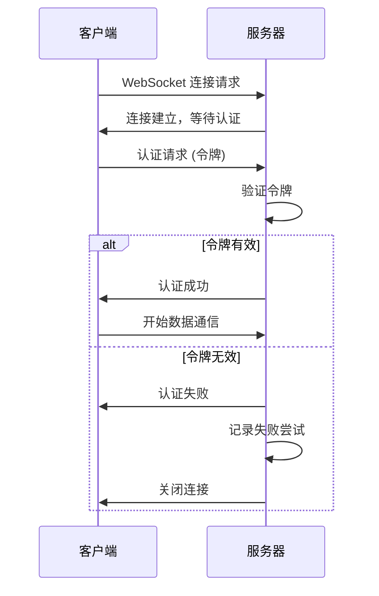

# PICORadar 安全指南

本文档详细说明 PICORadar 系统的安全特性、最佳实践和安全配置，帮助您在生产环境中安全地部署和运行系统。

## 目录

- [安全架构概览](#安全架构概览)
- [身份验证机制](#身份验证机制)
- [网络安全](#网络安全)
- [数据保护](#数据保护)
- [访问控制](#访问控制)
- [安全配置](#安全配置)
- [监控和审计](#监控和审计)
- [安全事件响应](#安全事件响应)

## 安全架构概览

### 威胁模型

PICORadar 系统面临的主要安全威胁：

1. **未授权访问**: 恶意客户端尝试连接服务器
2. **数据窃听**: 网络通信被截获和分析
3. **中间人攻击**: 攻击者伪装成服务器或客户端
4. **拒绝服务攻击**: 恶意流量导致服务不可用
5. **数据注入**: 恶意构造的数据包污染系统
6. **内部威胁**: 授权用户的恶意行为

### 安全防护层次

```
┌─────────────────────────────────────────┐
│              应用层安全                  │
│  • 令牌认证  • 数据验证  • 访问控制      │
├─────────────────────────────────────────┤
│              传输层安全                  │
│  • WebSocket安全  • 加密传输  • 证书     │
├─────────────────────────────────────────┤
│              网络层安全                  │
│  • 防火墙  • VPN  • 网络隔离             │
├─────────────────────────────────────────┤
│              主机安全                    │
│  • 操作系统安全  • 权限管理  • 监控      │
└─────────────────────────────────────────┘
```

## 身份验证机制

### 预共享令牌认证

PICORadar 使用预共享令牌（PSK）进行客户端认证：

#### 令牌生成

```bash
# 生成安全的随机令牌
openssl rand -hex 32

# 或使用更强的加密随机数
dd if=/dev/urandom bs=32 count=1 2>/dev/null | base64 | tr -d '=\n'
```

#### 令牌配置

服务端配置 (`config/server.json`)：

```json
{
  "authentication": {
    "enabled": true,
    "token": "${PICORADAR_AUTH_TOKEN}",
    "token_validation_timeout_ms": 5000,
    "max_failed_attempts": 3,
    "lockout_duration_ms": 300000
  }
}
```

环境变量设置：

```bash
# 生产环境中设置强令牌
export PICORADAR_AUTH_TOKEN="a1b2c3d4e5f6789012345678901234567890abcdef1234567890abcdef123456"
```

#### 令牌轮换策略

**建议的令牌轮换频率**：
- **开发环境**: 每周
- **测试环境**: 每月
- **生产环境**: 每季度或在安全事件后

**轮换步骤**：

```bash
#!/bin/bash
# token_rotation.sh

OLD_TOKEN="$PICORADAR_AUTH_TOKEN"
NEW_TOKEN=$(openssl rand -hex 32)

echo "Rotating token from: ${OLD_TOKEN:0:8}... to: ${NEW_TOKEN:0:8}..."

# 1. 更新服务器配置
export PICORADAR_AUTH_TOKEN="$NEW_TOKEN"
systemctl reload picoradar

# 2. 通知所有客户端更新令牌
# (需要根据您的客户端部署方式调整)

# 3. 验证新令牌工作正常
sleep 10
./test_client --token "$NEW_TOKEN"

# 4. 记录轮换日志
echo "$(date): Token rotated successfully" >> /opt/picoradar/logs/security.log
```

### 客户端认证流程



## 网络安全

### TLS/SSL 加密（推荐）

虽然在局域网环境中可选，但强烈建议启用 TLS：

#### 生成自签名证书

```bash
# 生成私钥
openssl genrsa -out picoradar.key 2048

# 生成证书签名请求
openssl req -new -key picoradar.key -out picoradar.csr

# 生成自签名证书
openssl x509 -req -days 365 -in picoradar.csr -signkey picoradar.key -out picoradar.crt

# 合并为 PEM 格式
cat picoradar.crt picoradar.key > picoradar.pem
```

#### 服务器 TLS 配置

```json
{
  "server": {
    "tls_enabled": true,
    "certificate_file": "/opt/picoradar/certs/picoradar.crt",
    "private_key_file": "/opt/picoradar/certs/picoradar.key",
    "cipher_suites": ["TLS_AES_256_GCM_SHA384", "TLS_CHACHA20_POLY1305_SHA256"]
  }
}
```

### 网络分隔

#### VLAN 配置

为 VR 设备创建专用 VLAN：

```bash
# 创建 VLAN 100 用于 VR 设备
sudo vconfig add eth0 100
sudo ifconfig eth0.100 192.168.100.1 netmask 255.255.255.0 up

# 配置防火墙规则，只允许必要的流量
iptables -A FORWARD -i eth0.100 -o eth0.100 -j ACCEPT
iptables -A FORWARD -i eth0.100 -p tcp --dport 9002 -j ACCEPT
iptables -A FORWARD -i eth0.100 -p udp --dport 9001 -j ACCEPT
iptables -A FORWARD -i eth0.100 -j DROP
```

#### 防火墙配置

高级 iptables 规则：

```bash
#!/bin/bash
# secure_firewall.sh

# 清除现有规则
iptables -F
iptables -X
iptables -t nat -F
iptables -t nat -X

# 设置默认策略
iptables -P INPUT DROP
iptables -P FORWARD DROP
iptables -P OUTPUT ACCEPT

# 允许回环接口
iptables -A INPUT -i lo -j ACCEPT

# 允许已建立的连接
iptables -A INPUT -m state --state RELATED,ESTABLISHED -j ACCEPT

# SSH 访问（限制源IP）
iptables -A INPUT -p tcp --dport 22 -s 192.168.1.0/24 -j ACCEPT

# PICORadar 服务端口
iptables -A INPUT -p tcp --dport 9002 -s 192.168.1.0/24 -j ACCEPT
iptables -A INPUT -p udp --dport 9001 -s 192.168.1.0/24 -j ACCEPT

# 限制连接频率（防止暴力攻击）
iptables -A INPUT -p tcp --dport 9002 -m limit --limit 10/min --limit-burst 20 -j ACCEPT

# 记录被丢弃的包
iptables -A INPUT -j LOG --log-prefix "DROPPED: "

# 丢弃所有其他流量
iptables -A INPUT -j DROP

# 保存规则
iptables-save > /etc/iptables/rules.v4
```

### 网络监控

#### 实时流量监控

```bash
#!/bin/bash
# network_monitor.sh

INTERFACE="eth0"
LOG_FILE="/opt/picoradar/logs/network_security.log"

# 监控异常流量
while true; do
    # 检查连接数
    CONN_COUNT=$(netstat -an | grep ":9002" | grep ESTABLISHED | wc -l)
    
    if [ $CONN_COUNT -gt 25 ]; then
        echo "$(date): WARNING: High connection count: $CONN_COUNT" >> $LOG_FILE
    fi
    
    # 检查带宽使用
    RX_BYTES=$(cat /sys/class/net/$INTERFACE/statistics/rx_bytes)
    sleep 1
    RX_BYTES_NEW=$(cat /sys/class/net/$INTERFACE/statistics/rx_bytes)
    BANDWIDTH=$((($RX_BYTES_NEW - $RX_BYTES) * 8 / 1024))  # Kbps
    
    if [ $BANDWIDTH -gt 10000 ]; then  # > 10 Mbps
        echo "$(date): WARNING: High bandwidth usage: ${BANDWIDTH} Kbps" >> $LOG_FILE
    fi
    
    sleep 60
done
```

## 数据保护

### 数据最小化

PICORadar 只收集必要的数据：

- **位置坐标** (x, y, z)
- **旋转信息** (四元数)
- **时间戳**
- **玩家标识符**

**不收集的敏感信息**：
- 个人身份信息
- 生物特征数据
- 音频/视频数据
- 设备唯一标识符

### 数据加密

#### 传输中加密

```cpp
// 客户端配置 TLS
ClientConfig config;
config.use_tls = true;
config.verify_certificate = false;  // 自签名证书
config.cipher_suites = {"TLS_AES_256_GCM_SHA384"};

Client client(config);
```

#### 静态数据加密

敏感配置文件加密：

```bash
# 加密配置文件
gpg --symmetric --cipher-algo AES256 server.json

# 解密配置文件
gpg --decrypt server.json.gpg > server.json
```

### 数据保留和删除

```json
{
  "data_retention": {
    "player_data_ttl_seconds": 300,
    "log_retention_days": 30,
    "backup_retention_days": 90,
    "auto_cleanup_enabled": true
  }
}
```

自动清理脚本：

```bash
#!/bin/bash
# data_cleanup.sh

LOG_DIR="/opt/picoradar/logs"
BACKUP_DIR="/opt/picoradar/backups"

# 清理超过30天的日志
find $LOG_DIR -name "*.log.*" -mtime +30 -delete

# 清理超过90天的备份
find $BACKUP_DIR -name "*.tar.gz" -mtime +90 -delete

# 清理内存中的过期玩家数据（通过API调用）
curl -X POST http://localhost:9002/admin/cleanup \
    -H "Authorization: Bearer $ADMIN_TOKEN"
```

## 访问控制

### 基于角色的访问控制

定义不同的访问级别：

```json
{
  "access_control": {
    "roles": {
      "player": {
        "permissions": ["send_position", "receive_positions"]
      },
      "observer": {
        "permissions": ["receive_positions"]
      },
      "admin": {
        "permissions": ["send_position", "receive_positions", "server_control", "user_management"]
      }
    },
    "token_roles": {
      "player_token_pattern": "player_*",
      "observer_token_pattern": "observer_*",
      "admin_token_pattern": "admin_*"
    }
  }
}
```

### 管理接口安全

保护管理接口：

```json
{
  "admin": {
    "enabled": true,
    "bind_address": "127.0.0.1",
    "port": 9003,
    "auth_token": "${PICORADAR_ADMIN_TOKEN}",
    "allowed_ips": ["127.0.0.1", "192.168.1.10"]
  }
}
```

## 安全配置

### 强化配置检查清单

#### 服务器配置

- [ ] 启用身份验证
- [ ] 使用强随机令牌
- [ ] 设置连接限制
- [ ] 启用详细日志记录
- [ ] 配置超时设置
- [ ] 禁用调试功能

#### 系统配置

- [ ] 最小化安装的软件包
- [ ] 禁用不必要的服务
- [ ] 配置防火墙规则
- [ ] 设置正确的文件权限
- [ ] 启用自动安全更新
- [ ] 配置日志轮转

#### 网络配置

- [ ] 使用专用网络段
- [ ] 启用网络监控
- [ ] 配置入侵检测
- [ ] 限制管理访问
- [ ] 禁用不必要的协议

### 安全配置验证

```bash
#!/bin/bash
# security_audit.sh

echo "PICORadar Security Audit Report"
echo "==============================="
echo "Date: $(date)"
echo ""

# 检查配置文件权限
echo "Configuration File Permissions:"
ls -la /opt/picoradar/config/
echo ""

# 检查服务状态
echo "Service Status:"
systemctl status picoradar --no-pager
echo ""

# 检查网络端口
echo "Network Ports:"
netstat -tlnp | grep -E "(9001|9002)"
echo ""

# 检查防火墙规则
echo "Firewall Rules:"
iptables -L -n | grep -E "(9001|9002)"
echo ""

# 检查日志文件
echo "Recent Security Events:"
tail -20 /opt/picoradar/logs/security.log
echo ""

# 检查证书有效期
if [ -f "/opt/picoradar/certs/picoradar.crt" ]; then
    echo "Certificate Expiry:"
    openssl x509 -in /opt/picoradar/certs/picoradar.crt -noout -dates
    echo ""
fi
```

## 监控和审计

### 安全事件监控

实现实时安全监控：

```bash
#!/bin/bash
# security_monitor.sh

ALERT_EMAIL="admin@company.com"
LOG_FILE="/opt/picoradar/logs/security.log"

# 监控认证失败
tail -f /opt/picoradar/logs/server.ERROR | while read line; do
    if echo "$line" | grep -q "Authentication failed"; then
        echo "$(date): SECURITY ALERT: Authentication failure detected" >> $LOG_FILE
        echo "$line" | mail -s "PICORadar Security Alert" $ALERT_EMAIL
    fi
done &

# 监控异常连接
tail -f /opt/picoradar/logs/server.INFO | while read line; do
    if echo "$line" | grep -q "Connection from"; then
        IP=$(echo "$line" | grep -o '[0-9]\{1,3\}\.[0-9]\{1,3\}\.[0-9]\{1,3\}\.[0-9]\{1,3\}')
        
        # 检查IP是否在允许列表中
        if ! grep -q "$IP" /opt/picoradar/config/allowed_ips.txt; then
            echo "$(date): SECURITY ALERT: Connection from unknown IP: $IP" >> $LOG_FILE
        fi
    fi
done &
```

### 审计日志

配置详细的审计日志：

```json
{
  "audit": {
    "enabled": true,
    "log_file": "/opt/picoradar/logs/audit.log",
    "events": [
      "authentication_attempt",
      "connection_established",
      "connection_closed",
      "data_received",
      "admin_action",
      "configuration_change"
    ],
    "include_client_ip": true,
    "include_timestamp": true,
    "include_user_agent": false
  }
}
```

### 合规性检查

定期合规性检查脚本：

```bash
#!/bin/bash
# compliance_check.sh

echo "PICORadar Compliance Check"
echo "========================="

# 检查数据保留政策
echo "Data Retention Compliance:"
find /opt/picoradar/logs -name "*.log" -mtime +30 | wc -l | xargs echo "Files exceeding retention policy:"

# 检查访问控制
echo "Access Control Compliance:"
if [ -f "/opt/picoradar/config/server.json" ]; then
    if grep -q '"enabled": true' /opt/picoradar/config/server.json; then
        echo "✓ Authentication enabled"
    else
        echo "✗ Authentication disabled"
    fi
fi

# 检查加密配置
echo "Encryption Compliance:"
if grep -q '"tls_enabled": true' /opt/picoradar/config/server.json; then
    echo "✓ TLS encryption enabled"
else
    echo "✗ TLS encryption disabled"
fi
```

## 安全事件响应

### 事件分类

**严重程度级别**：

1. **严重 (Critical)**: 系统被攻破，数据泄露
2. **高 (High)**: 未授权访问尝试，服务中断
3. **中 (Medium)**: 异常活动，性能影响
4. **低 (Low)**: 配置问题，日志异常

### 响应程序

#### 严重安全事件响应

```bash
#!/bin/bash
# emergency_response.sh

echo "SECURITY INCIDENT RESPONSE INITIATED"
echo "Time: $(date)"

# 1. 隔离系统
echo "1. Isolating system..."
iptables -P INPUT DROP
iptables -P FORWARD DROP
systemctl stop picoradar

# 2. 保留证据
echo "2. Preserving evidence..."
mkdir -p /tmp/incident_$(date +%s)
cp -r /opt/picoradar/logs /tmp/incident_$(date +%s)/
netstat -an > /tmp/incident_$(date +%s)/netstat.txt
ps aux > /tmp/incident_$(date +%s)/processes.txt

# 3. 通知管理员
echo "3. Notifying administrators..."
echo "SECURITY INCIDENT: PICORadar system isolated at $(date)" | \
    mail -s "URGENT: Security Incident" admin@company.com

# 4. 生成事件报告
echo "4. Generating incident report..."
./generate_incident_report.sh > /tmp/incident_$(date +%s)/report.txt

echo "Emergency response completed. System isolated."
```

### 恢复程序

```bash
#!/bin/bash
# recovery.sh

echo "SYSTEM RECOVERY INITIATED"

# 1. 更新所有令牌
echo "1. Rotating all tokens..."
NEW_TOKEN=$(openssl rand -hex 32)
export PICORADAR_AUTH_TOKEN="$NEW_TOKEN"

# 2. 更新配置
echo "2. Updating security configuration..."
cp /opt/picoradar/config/server.json.secure /opt/picoradar/config/server.json

# 3. 重启防火墙
echo "3. Reconfiguring firewall..."
./secure_firewall.sh

# 4. 验证系统安全
echo "4. Running security verification..."
./security_audit.sh

# 5. 重启服务
echo "5. Restarting services..."
systemctl start picoradar

echo "Recovery completed. Please verify system functionality."
```

### 事后分析

事件后分析模板：

```markdown
# 安全事件报告

## 事件概览
- **事件ID**: INC-YYYY-MM-DD-001
- **发生时间**: YYYY-MM-DD HH:MM:SS
- **发现时间**: YYYY-MM-DD HH:MM:SS
- **严重程度**: [Critical/High/Medium/Low]
- **状态**: [Open/Investigating/Resolved/Closed]

## 事件描述
[详细描述发生的事件]

## 影响评估
- **受影响系统**: 
- **数据泄露**: 是/否
- **服务中断时间**: X 小时 Y 分钟
- **受影响用户数量**: X

## 根本原因分析
[分析事件的根本原因]

## 响应措施
[描述采取的响应措施]

## 预防措施
[描述为防止类似事件而采取的措施]

## 经验教训
[从事件中学到的经验教训]
```

---

更多信息请参考：
- [部署指南](DEPLOYMENT.md)
- [监控指南](docs/MONITORING.md)
- [合规性文档](docs/COMPLIANCE.md)
